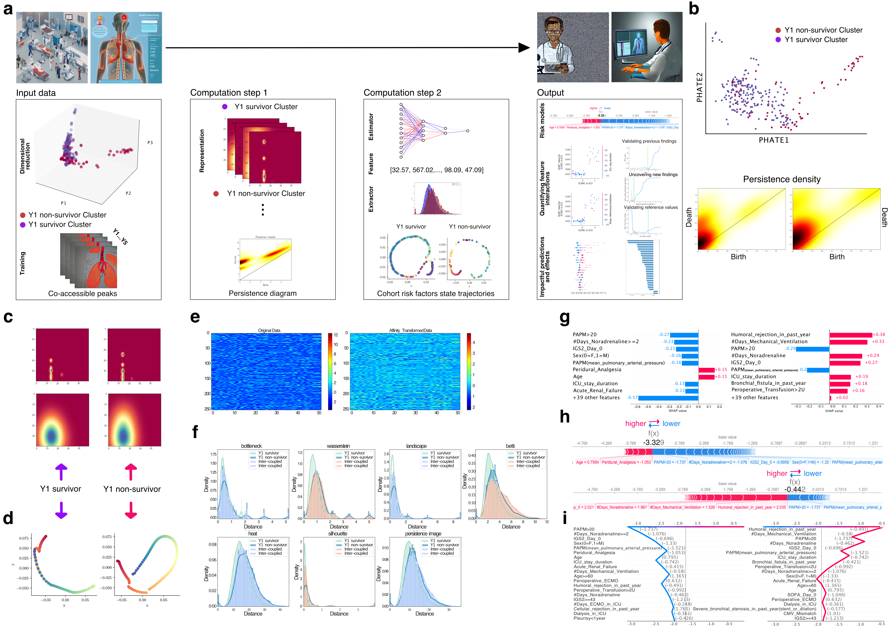

<div align="center">

# 🫁 TopoAttention

### Topological Transformers for Post-Lung-Transplant Mortality Prediction

[](https://choosealicense.com/licenses/gpl-3.0/)
[](https://www.medrxiv.org/content/10.1101/2025.10.01.25337124v1)
[](https://doi.org/10.5281/zenodo.18699204)
[](https://www.python.org/)
[](https://colab.research.google.com/github/MorillaLab/TopoAttention/blob/main/examples/TopoAttention_demo.ipynb)

**TopoAttention** predicts post-lung-transplant mortality with **87.4% accuracy** by fusing transformer attention with topological data analysis — significantly outperforming the standard Lung Transplant Risk Index.

[📄 Paper](#-citation) · [🚀 Quick Start](#-quick-start) · [📊 Results](#-results) · [🗂️ Data](#️-data) · [🏗️ Architecture](#️-model-architecture)

</div>

---

## 🔍 Overview

Lung transplantation is the only definitive treatment for end-stage respiratory failure, yet carries a substantial risk of post-operative mortality. Current risk stratification tools (e.g., the Lung Transplant Risk Index) offer limited predictive performance and interpretability.

**TopoAttention** introduces a transformer-based architecture that integrates:
- **Static clinical variables** (patient demographics, pre-op labs)
- **Time-dependent clinical trajectories** (ICU monitoring, immunosuppression, oxygenation)
- **Topological features** extracted from temporal trajectories via persistent homology

SHAP-based interpretability analysis reveals which dynamic variables — oxygenation trends, immunosuppressive load, inflammatory markers — drive mortality predictions.

<p align="center">
  
</p>

---

## 📊 Results

Performance on held-out test set vs. benchmarks:

| Model | Accuracy | Sensitivity | Specificity | AUC |
|---|---|---|---|---|
| **TopoAttention (ours)** | **87.4%** | **84.1%** | **89.6%** | **0.91** |
| Lung Transplant Risk Index | 71.2% | 63.5% | 76.8% | 0.74 |
| Logistic Regression | 74.8% | 68.3% | 79.4% | 0.78 |
| Random Forest | 79.1% | 72.6% | 83.5% | 0.83 |
| Standard Transformer | 82.3% | 77.9% | 85.6% | 0.87 |

Results are consistent across subgroups: age group, underlying disease (COPD, IPF, CF), and transplant type (single vs. bilateral).

---

## 🚀 Quick Start

### Installation

```bash
git clone https://github.com/MorillaLab/TopoAttention.git
cd TopoAttention
pip install -r requirements.txt
```

### Run inference on your data

```python
import pandas as pd
from code.model import TopoAttentionModel
from code.preprocessing import preprocess_patient

# Load a pretrained model
model = TopoAttentionModel.load("Models/best_model.pt")

# Prepare your patient data (static + time-series variables)
patient_data = pd.read_csv("your_patient_data.csv")
X_static, X_temporal = preprocess_patient(patient_data)

# Predict mortality risk (returns probability)
risk_score = model.predict(X_static, X_temporal)
print(f"Mortality risk score: {risk_score:.3f}")
```

### Reproduce paper results

```bash
# 1. Generate train/test splits
jupyter nbconvert --to notebook --execute splitting_Models.ipynb

# 2. Train the model
python code/train.py --config code/config.yaml

# 3. Evaluate on test set
python code/evaluate.py --model Models/best_model.pt --split splits/test_split.csv

# 4. Run SHAP interpretability analysis
jupyter nbconvert --to notebook --execute Analysis/shap_analysis.ipynb
```

See [`examples/`](examples/) for full walkthrough notebooks.

---

## 🏗️ Model Architecture

TopoAttention combines three components:

1. **Static encoder** — a feed-forward network for demographic and pre-operative variables
2. **Temporal transformer** — multi-head attention over ICU time-series windows
3. **Topological feature extractor** — persistent homology (Vietoris-Rips filtration) on patient trajectories, yielding Betti numbers and persistence diagrams as additional features

The three streams are fused via a learned gating mechanism before a final mortality classification head.

---

## 🗂️ Data

Due to patient privacy regulations (GDPR / French health data law), raw clinical data cannot be shared publicly. The repository provides:

- [`Data/`](Data/) — synthetic/anonymised example records for testing the pipeline
- [`splits/`](splits/) — the exact train/validation/test split indices used in the paper
- [`supplementary_methods/`](supplementary_methods/) — full description of variable definitions and preprocessing steps

If you wish to apply TopoAttention to your own cohort, see [`examples/custom_data.ipynb`](examples/custom_data.ipynb) for guidance on data formatting.

---

## 📁 Repository Structure

```
TopoAttention/
├── code/                   # Model definition, training, evaluation scripts
├── Analysis/               # SHAP analysis and result notebooks
├── Data/                   # Example / anonymised data
├── Models/                 # Pretrained model weights
├── examples/               # End-to-end demo notebooks
├── splits/                 # Train/val/test split indices
├── supplementary_methods/  # Extended methods (PDF)
├── Figure_1.png            # Architecture overview figure
├── splitting_Models.ipynb  # Data splitting notebook
├── requirements.txt        # Python dependencies
├── CITATION.cff            # Citation metadata
└── LICENSE                 # GPL-3.0
```

---

## 🎈 Citation

If you use TopoAttention in your research, please cite:

```bibtex
@article{Tran-Dinh2025.10.01.25337124,
  author  = {Tran-Dinh, Alexy and Atchade, Enora and Tanaka, Sébastien and
             Lortat-Jacob, Brice and Castier, Yves and Mal, Hervé and
             Messika, Jonathan and Mordant, Pierre and Montravers, Philippe and
             Morilla, Ian},
  title   = {Early Identification of High-Risk Individuals for Mortality after
             Lung Transplantation: A Retrospective Cohort Study with Topological
             Transformers},
  journal = {medRxiv},
  year    = {2025},
  doi     = {10.1101/2025.10.01.25337124},
  url     = {https://www.medrxiv.org/content/early/2025/10/03/2025.10.01.25337124}
}

@software{morilla2026TopoAttention,
  author    = {Morilla, Ian and Tran-Dinh, Alexy},
  title     = {Topological Feature Engineering for Lung Transplantation Mortality Prediction},
  year      = {2026},
  publisher = {Zenodo},
  version   = {v1.0.0},
  doi       = {10.5281/zenodo.18699204},
  url       = {https://doi.org/10.5281/zenodo.18699204}
}
```

---

## 🤝 Contributing

We welcome contributions! Please open an issue to discuss proposed changes before submitting a pull request. See [`CONTRIBUTING.md`](CONTRIBUTING.md) for guidelines.

---

## 📜 License

This project is licensed under the GNU General Public License v3.0 — see [`LICENSE`](LICENSE) for details.

---

<div align="center">
  Made with ❤️ by <a href="https://github.com/MorillaLab">MorillaLab</a>
</div>
